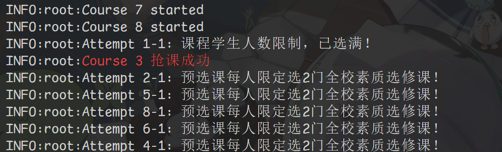

# cqupt-courseizer

### 小学弟，你拿什么和你计科学长抢课？😋

> 如果有用的话就点个 ⭐Star 吧 ～(∠・ω< )⌒⭐

简体中文 | [English](/README_en-US.md)

## 项目简介

本 Python 脚本可以让你解放双手，并且比别人更快一步！  
可以搜索交叉通识课（人文社会科学，自然科学与技术）中包含指定关键字的课程并且自动开始并发抢课  
~~目前未支持培养方案课程因为不想学也得学~~  
现已支持班级课表，因为某些专业的专业选修课~~太难抢~~

## 从源码构建

本项目使用 Python 3.13 构建，理论上支持 3.6 以上版本

### 安装依赖（已安装可以跳过）

> 如果你还没有 Python 解释器，前往[官网](https://www.python.org/downloads/)下载

```bash
pip3 install requests
```

### 克隆项目

```bash
git clone --depth=1 https://github.com/jhll1124/cqupt-courseizer.git
```

> 当然也可以直接 Download Zip

```bash
wget https://github.com/jhll1124/cqupt-courseizer/archive/refs/heads/main.zip
```

### 更改 `main.py` 中主函数的 `cookie` 和 `search_ls`

就可以开始愉快の抢课辣！  
对 search_ls 中的每个字符串，只要课程信息包含就会去抢，支持课程 id、名称、授课教师等  
为了确保准确性，不支持模糊搜索  
预制了三档抢课速度，修改 `loop_rob` 函数的 `mode` 参数可以更改时间间隔  

> 为防止滥用，cookie 和课程列表需要自己获取，源码中的 cookie 仅为示例

## 获取 cookie

几种方法任选其一

1. 浏览器按 F12 打开开发者工具，在网络标签选择一个请求，在请求标头中找
2. 在浏览器的地址栏输入：`javascript:alert(document.cookie)` (不区分大小写) ~~（可能会被浏览器吃掉一部分）~~
3. 通过浏览器插件[Cookie-Editor](https://chromewebstore.google.com/detail/cookie-editor/hlkenndednhfkekhgcdicdfddnkalmdm)

## Tips

1. 本脚本只适用于预选课，不适用于二次选课
2. 服务器端每几个小时（目前不清楚）会重置会话，需要重新填写 cookie
3. 此版本仍在测试中，如有 bug 请提交 issue

## 截图 😋



## 其他功能

自己去源码探索吧~ ~~一定不是我懒得写~~

## 鸣谢

> 感谢以下项目为本项目提供灵感和思路

[cqupt-grabber](https://github.com/LgoLgo/cqupt-grabber)

## 许可证

本项目使用 GPLv3 许可证，允许自由使用、修改和分发代码，但必须遵循相应条款，包括标明原作者和修改内容、提供源代码并保持 GPLv3 许可证、以及贡献者授权使用其专利权。本项目按“现状”提供，不提供任何形式的担保。完整许可证请参见 [GPLv3](https://www.gnu.org/licenses/gpl-3.0.html)。
