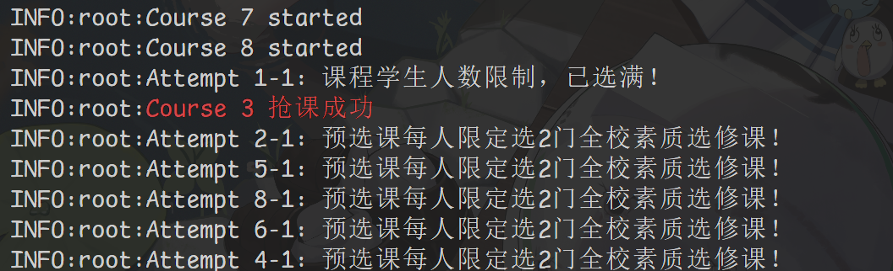

# cqupt-courseizer

### 小学弟，你拿什么和你计科学长抢课？😋

> 如果有用的话就点个 ⭐Star 吧 ～(∠・ω< )⌒⭐

简体中文 | [English](/README_en-US.md)

## 项目简介

本项目是一个重庆邮电大学教务系统自动抢课脚本，可以让你解放双手，比别人更快一步！

### 功能特性

- ✅ **自动查询课程**：支持交叉通识课（人文社会科学，自然科学与技术）、班级课表
- ✅ **关键词搜索**：根据课程 ID、课程名称、授课教师等关键词精准匹配
- ✅ **并发抢课**：多线程同时抢多门课程，效率更高
- ✅ **多种模式**：快速、慢速、捡漏三档速度，还支持自定义间隔
- ✅ **配置灵活**：使用 YAML 配置文件，修改方便，敏感信息不会泄露

> ~~目前未支持培养方案课程，因为不想学也得学~~

## 快速开始

### 环境要求

本项目使用 Python 3.13 构建，理论上支持 Python 3.6 及以上版本

> 如果你还没有 Python 解释器，前往[官网](https://www.python.org/downloads/)下载

### 1. 获取项目

**方式一：克隆仓库**

```bash
git clone --depth=1 https://github.com/jhll1124/cqupt-courseizer.git
cd cqupt-courseizer
```

**方式二：下载压缩包**

直接下载 [ZIP 文件](https://github.com/jhll1124/cqupt-courseizer/archive/refs/heads/main.zip)并解压

### 2. 安装依赖

**推荐方式：**

```bash
pip3 install -r requirements.txt
```

**手动安装：**

```bash
pip3 install requests pyyaml
```

### 3. 配置文件

**步骤一：创建配置文件**

```bash
cp config.example.yml config.yml
```

**步骤二：编辑配置**

打开 `config.yml`，填写以下内容：

- **`cookie`**（必填）：教务系统登录凭证，获取方法见下文
- **`courses`**（必填）：课程关键词列表，支持课程 ID、课程名称、授课教师等
  - 只要课程信息中包含关键词就会尝试抢课
  - 为确保准确性，不支持模糊搜索
- **`mode`**（可选）：抢课速度模式，默认为 1
  - `1` - 快速模式（0.25秒间隔）
  - `2` - 慢速模式（5秒间隔）
  - `3` - 捡漏模式（100秒间隔）
  - 或填写自定义秒数，如 `0.5`

> **注意：** 为防止滥用，cookie 需要自行获取。配置文件 `config.yml` 已加入 `.gitignore`，不会被提交到 Git

### 4. 运行程序

```bash
python main.py
```

## 获取 Cookie

以下方法任选其一：

**方法一：开发者工具（推荐）**

1. 登录教务系统后，按 `F12` 打开开发者工具
2. 切换到「网络」(Network) 标签
3. 刷新页面，选择任意请求
4. 在「请求标头」(Request Headers) 中找到 `Cookie` 字段并复制

**方法二：地址栏执行**

在浏览器地址栏输入以下代码并回车：

```javascript
javascript:alert(document.cookie)
```

> ~~可能会被浏览器吃掉一部分（）~~

**方法三：浏览器插件**

使用 [Cookie-Editor](https://chromewebstore.google.com/detail/cookie-editor/hlkenndednhfkekhgcdicdfddnkalmdm) 插件直接查看和复制

## 注意事项

1. **适用范围**：本脚本仅适用于预选课阶段，不适用于二次选课
2. **Cookie 失效**：教务系统会定期重置会话（具体时间不定），届时需要重新获取 Cookie
3. **测试版本**：此版本仍在测试中，如遇到 bug 请提交 [Issue](https://github.com/jhll1124/cqupt-courseizer/issues)

## 截图 😋



## 其他功能

自己去源码探索吧~ ~~一定不是我懒得写~~

## 鸣谢

> 感谢以下项目为本项目提供灵感和思路

[cqupt-grabber](https://github.com/LgoLgo/cqupt-grabber)

## 免责声明

本项目仅供学习交流使用，使用者需自行承担风险。

- 本项目不对使用后果负责
- 请遵守学校相关规定
- 建议合理使用，避免给服务器造成过大压力
- 作者不鼓励滥用本工具

## 许可证

本项目使用 GPLv3 许可证，允许自由使用、修改和分发代码，但必须遵循相应条款，包括标明原作者和修改内容、提供源代码并保持 GPLv3 许可证、以及贡献者授权使用其专利权。本项目按现状提供，不提供任何形式的担保。完整许可证请参见 [GPLv3](https://www.gnu.org/licenses/gpl-3.0.html)。
